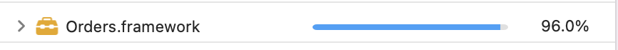
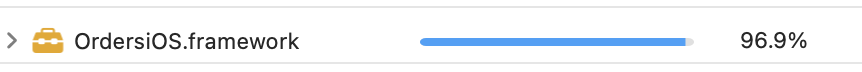
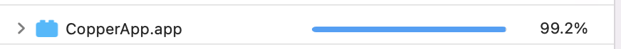
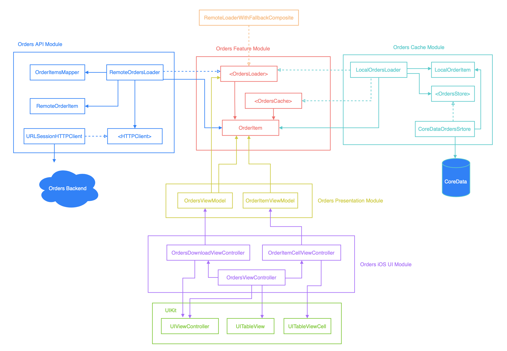

# Copper App

App is fully tested with Unit, Integration, and Acceptance tests.

Test Coverages:

### Orders.framework

Contains, different implementations of `OrderLoading` feature: `RemoteOrderLoader` and `LocalOrdersLoader`

### OrdersiOS.framework

iOS specific implementation of orders loader feature which uses UIKit to display orders. Focused on only displaying Orders, source of data doesn’t matter. we could easily verify UI with snapshot tests, without even running the app!

### Copper.app

This is the main module and composition root of the app, which composes iOS specific UI implementation with Remote and Local loaders to cover business requirements with support of Acceptance tests.  because from early stage we followed **SOLID** principles we can easily change behavior of the app without changing existing code, just by the we we compose loaders.

## High level dependency diagram

##
